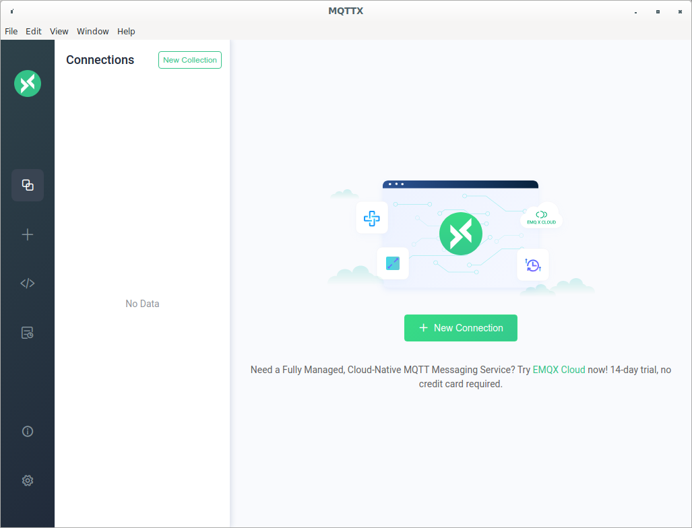
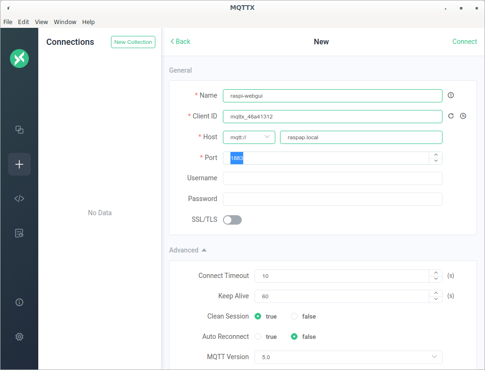
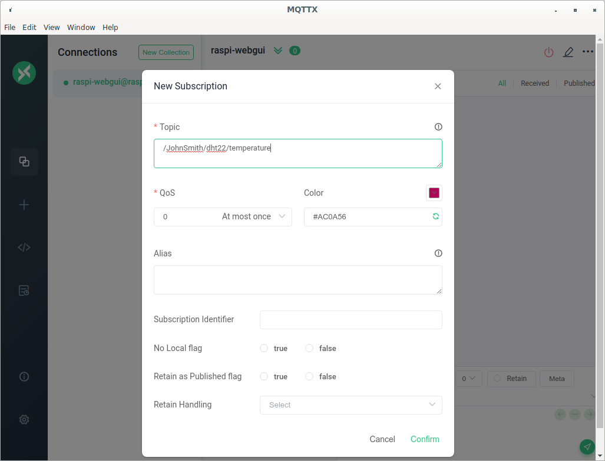
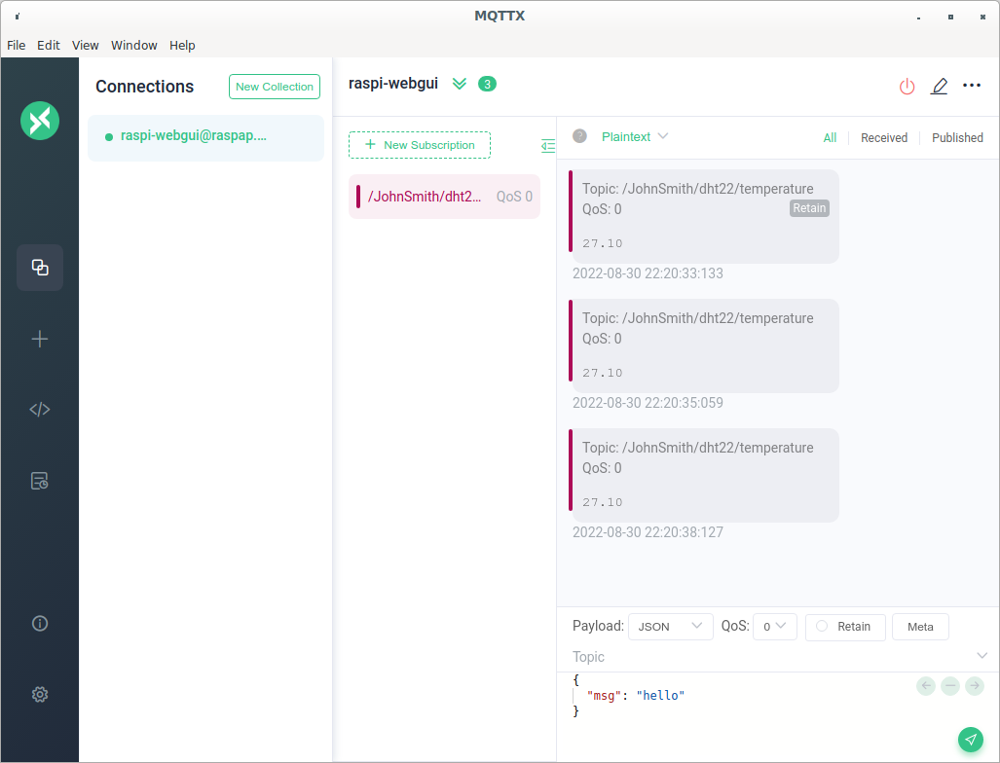

:::::::::::::::::::::::::::::::::::::: questions 

- What does one need to get the information published by sensors on the IoT?
- What is meant by "topic" in terms of MQTT?

::::::::::::::::::::::::::::::::::::::::::::::::

::::::::::::::::::::::::::::::::::::: objectives

- Connecting to an MQTT broker
- Subscribing to topics 

::::::::::::::::::::::::::::::::::::::::::::::::

## Our current status

In the previous episodes we have:

1. Added the URL in the IDE's preferences to detect the configurations for the ESP32 board 
3. Installed the library required for the DHT sensors
4. Connected a DHT11 or DHT22 sensor to an ESP32 microcontroller board
5. Entered the code in a sketch to get temperature readings from the DHT sesions
6. Connected a Light Dependent Resistor to the same ESP32 microcontroller board
7. Entered the code in a sketch to get light level readings from the LDR
8. Entered the code in the sketch to connect to our local network and publish the sensor readings to an MQTT broker

## Subscribing to an MQTT topic

At this point your ESP microcontroller board should have a temperature and a light level sensor on it. It should have connected to your local network and to an MQTT broker and it is publishing the readings to a topic to the MQTT broker.

We now need client software to connect to the MQTT broker and subscribe to the topic to which your sensor readings are published. There are quite a few clients available as well as libraries for several programming languages including Python. For this lesson we are going to use MQTTX, a cross platform, open source application. Hopefully you were able to install MQTTX as descripted on the [setup](leaners/setup.md) page.

Let's start by running MQTTX. If it is the first time you are running it, a window similar to the image below should open:

Click on the green `+ New Connection` button and then following window should appear:

You now need the information of the MQTT broker that you want to subscribe to. Your instructor should provide you with the correct information. If you are using a local MQTT broker and Raspberry Pi access point your information will be something along the following lines:

1. Name: raspi-webgui (this can be any name of your choosing)
2. Client ID: mqttx_46a41312 (this will be different for everyone. You can leave it as is, or change it if you want.)
3. Host mqtt://  raspap.local
4. Port: 1883

Click on `Connect` in the top right hand corner of the window. A small box should appear for a short while, saying `CONNECTED`, after which the screen should look as follows:

We are now connected to the MQTT broker and we can now subscribe to a topic.

Click on th `+New Subscription` button. Enter `/JohnSmith/dht22/temperature` (replacing JohnSmith with your name as you entered it into the sketch) in the `*Topic` field and click the `Confirm button`.

You should now see messages pop up showing the top and a value.

:::: challenge

Can you add a new subscription to subscribe to the light level that is being published from your ESP32?

::::

## Exporting data

MQTTX allows us to export the data that it receives to various formats. Allow MQTTX to run for a while to accumulate some data and then export the data to a JSON file. It is possible to export the data to a CSV but the format appears to be in a somewhat obscure format. It is possible to use convert the JSON to CSV using a converter such as the online converter that is available at [www.convertcsv.com/json-to-csv.htm](www.convertcsv.com/json-to-csv.htm)

::::::::::::::::::::::::::::::::::::: keypoints 

- Subscribing to an MQTT topic

::::::::::::::::::::::::::::::::::::::::::::::::

[r-markdown]: https://rmarkdown.rstudio.com/
