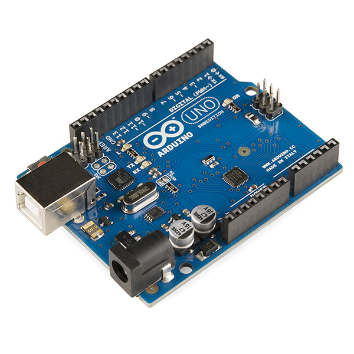

:::::::::::::::::::::::::::::::::::::: questions 

- What is the Internet of Things?
- How does one connect something to the Internet of Things?

::::::::::::::::::::::::::::::::::::::::::::::::

::::::::::::::::::::::::::::::::::::: objectives

- Explain what the Internet of Things is.
- Explain what can kind of things can be found on the Internet of Things.
- How are things connected to the Internet of Things.

::::::::::::::::::::::::::::::::::::::::::::::::

## Introduction

You might hear "Internet of Things" (IoT) and Arduino mentioned together and quite often those terms are used as if the one implies the other. However, this is not the case. The Internet of Things refers to all kinds of "Things" that have been connected to the Internet to sense the environment. You can almost think of IoT as the five senses of the Internet. "So what is this Arduino thing then?", you may ask. Well, Arduinos are little devices (open-source electronics platform) that were designed to teach people about electronics and they can be used to build electronic circuits that can be connected to the Internet to serve as part of the Internet's sensing. The main component on an Arduino is a motorcontroller which is an "integrated circuit" (or you might know it as a chip) that can be used in conjunction other electronic components to control things such as motors and sensors. However, the Arduino is not the only such device, some other popular devices are the ESP32 and ESP8266 boards. To complicate things somewhat, each of these boards come in different flavours - or, at least, different models.


<figcaption align = "center"><b>The original and most basic Arduino</b></figcaption>

Follow this [link to the Arduino site](https://www.arduino.cc/en/hardware) if you would like to see the whole range of Arduino models that are available.

:: instructor

Notes for the instructor

::

::: challenge 

## Challenge 1: Can you do it?

Which of the following is part of the Internet of things

:::: solution 

## Output
 
```output
[1] "This new lesson looks good"
```

::::


:::


::::::::::::::::::::::::::::::::::::: keypoints 

- Define the Internet of Things
- Identify devices that can be connected to the Internet of Things
- Explain how things can be connected to the Internet of Thingssu

::::::::::::::::::::::::::::::::::::::::::::::::

[r-markdown]: https://rmarkdown.rstudio.com/
