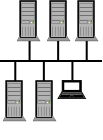
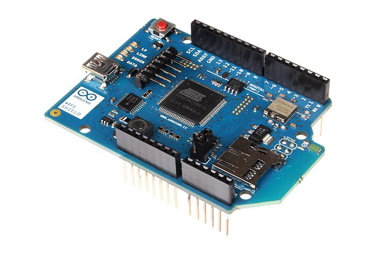
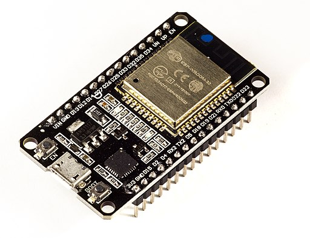

:::::::::::::::::::::::::::::::::::::: questions 

- What is the Internet of Things?
- How does one connect something to the Internet of Things?
- What is a microcontroller?
- What is an Arduino?

::::::::::::::::::::::::::::::::::::::::::::::::

::::::::::::::::::::::::::::::::::::: objectives

- Explain what the Internet of Things is.
- Explain what kind of things can be found on the Internet of Things.
- Explain how things are connected to the Internet of Things.

::::::::::::::::::::::::::::::::::::::::::::::::

## The Internet of Things

You might hear "Internet of Things" (IoT) and Arduino mentioned together and quite often those terms are used as if the one implies the other. However, this is not the case. The Internet of Things refers to all kinds of "Things" that have been connected to the Internet to sense the environment. You can almost think of IoT as the five senses of the Internet. 

Before we continue we should clarify some key terminology used in networking. When two or more computers are connected such that they can communicate it is called a **network**. 

<figcaption align = "center">
 <b>Computers connected to form a network</b> 
 </figcaption>
 
 
 It is also worth mentioning that one should distinguish between the words "internet" (with a lower case i) and "Internet" (with an upper case I). With an upper case I, ***Internet*** refers to *the* Internet that we connect to view web pages such as Google, Amazon etc, or to which we connect to to make Zoom or Skype calls. The Internet is a worldwide collection of networks that we are able to connect to via our Internet Service Providers. The Internet is also sometimes referred to as ***The Cloud***. With a lower case i, ***internet*** refers to a collection of networks that are connected. If university A has a network on campus and university B has a network and they decide to connect the two networks then they would have an internet. However they might not necessarily be connected to The Internet. Another term that you might hear is ***intranet***. If and instution connects their network to the Internet, they will refer to their internal network as the intranet. So university A can refer to their network as their intranet. If university A connects their intranet to that of University B, they created an internet.

<figcaption align = "center">
 <b>When two networks are connected they form an internet. These networks can connect to the worldwide internet known as The Internet.</b> 
 </figcaption>

## Microcontrollers

"So what is this Arduino thing then?", you may ask. Well, Arduinos are little devices (open-source electronics platform) that were designed to teach people about electronics and they can be used to build electronic circuits that can be connected to the Internet to serve as part of the Internet's sensing. The main component on an Arduino is a microcontroller which is an "integrated circuit" (or you might know it as a chip) that can be used in conjunction with other electronic components to control things such as motors and sensors. It is, in actual fact, a very small computer and can also be programmed. However, the Arduino is not the only such device, some other popular devices are the ESP32 and ESP8266 boards. To complicate things somewhat, each of these boards come in different flavours - or, at least, different models.

<figcaption align = "center"><b>The original and most basic Arduino - the Arduino Uno</b> SparkFun Electronics from Boulder, USA, CC BY 2.0 <https://creativecommons.org/licenses/by/2.0>, via Wikimedia Commons</figcaption>

The main thing to notice about the Arduino in the image above is that it has no connectivity to the Internet. So even if we connect sensors to the Arduino  it cannot make part of the Internet of Things without being connected to the Internet. However, one can purchase (or build it yourself) a WiFi shield that fits on top of the Arduino and with the shield in place you can program the Arduino to connect to the Internet and publish all the data it retrieves, via the sensors that you connect to it, to the Internet.

Below is an image of the WiFi shield and you might be able to see how its pins allows it to be fitted onto the Arduino Uno.

<figcaption align = "center">
 <b>A WiFi shield for the Arduino Uno</b> 
 Attribution: oomlout, CC BY-SA 2.0 <https://creativecommons.org/licenses/by-sa/2.0>, via Wikimedia Commons
 </figcaption>

 
There are now several models of Arduinos available, some with onboard WiFi or BlueTooth to allow connectivity to a network. Follow this [link to the Arduino site](https://www.arduino.cc/en/hardware) if you would like to see the whole range of Arduino models that are available.
 
 
For the purposes of this workshop your instructor might choose to not use an Arduino but rather one of the other options that are available. It doesn't really matter which one you use because for the projects covered in this lesson, any of them will do. Often, one of the ESP32 or ESP8266 series are chosen because they have onboard WiFi and are also significantly cheaper than Arduinos.
 

 <figcaption align = "center">
  <b>An ESP32 WROOM 32</b> 
  Attribution: Ubahnverleih, CC0, via Wikimedia Commons
 </figcaption>
 
 

The two main requirements for the device selected would be that it is 1) WiFi enabled and 2) can be programmed using the Arduino Integrated Development Environment (IDE). An IDE is just a computer program that provides a programming environment that makes things easier for programmers.

::: instructor

Notes for the instructor

:::

::: challenge 

## Challenge 1: Which of the following are part of the Internet of things?

With the person next to you, discuss whether you think the following devices are part of the Internet and why? What other devices do you think would make part of the Internet of Things.

1. A computer
2. An Arduino
3. A traffic camera
4. A device publishing current temperature to the Internet
5. A smart phone

:::

 
 Links:
 
 -[Microcontrollers vs Microprocessors](https://www.guru99.com/difference-between-microprocessor-and-microcontroller.html)
 -[Smartphone in the IoT Era](https://bridgera.com/smartphones-in-the-iot-era/)

::::::::::::::::::::::::::::::::::::: keypoints 

- Explain the difference between the terms: network, internet, intranet and The Internet
- Identify devices that can be connected to the Internet of Things
- Explain how things can be connected to the Internet of Things.
- Explain what a microcontroller is.
- Explain what an Arduino or and ESP32/8266 is.

::::::::::::::::::::::::::::::::::::::::::::::::

[r-markdown]: https://rmarkdown.rstudio.com/
