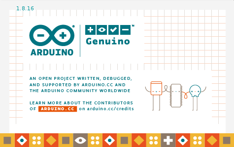
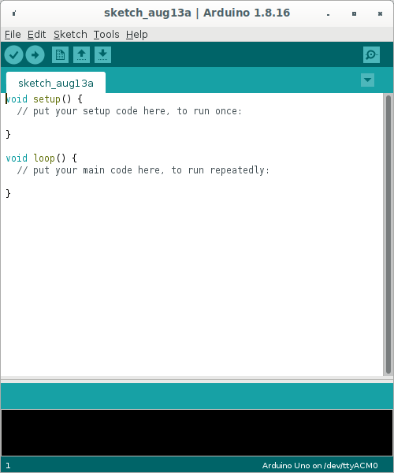

:::::::::::::::::::::::::::::::::::::: questions 

- What is an IDE?
- What is the purpose of the Arduino IDE?
- Which microcontrollers can be programmed with the Arduino IDE?
- How is the Arduino IDE used to program a microcontroller?
- How are microcontroller boards connected to the computer?
- How does the Arduino IDE connect to the microcontroller?
::::::::::::::::::::::::::::::::::::::::::::::::

::::::::::::::::::::::::::::::::::::: objectives

- Explain what an IDE is.
- Explain what the Arduino IDE is used for.
- Identify microcontrollers that can be programmed with the Arduino IDE.
- Run the Arduino IDE.
- Connect the microcontroller board to the computer.
- Connect the microcontroller to the Arduino IDE.

::::::::::::::::::::::::::::::::::::::::::::::::

For this episode we have to assume that you were able to successfully install the Arduino IDE and that you are able to start the software from the start menu or the desktop of your computer. When you run the software you will first see the splash window:

<figcaption align = "center">
 <b>The Arduino splash screen which is shown when the program starts</b>
 </figcaption>
 
 
After a while the IDE will open. It is actually quite a simple interface. At the top you should see the File, Edit, Sketch, Tools and Help menu items. Just below the menu there are five icons to the left and one on the far right. Below the icons you should see a tab with a filename and a white editing area. Below the editing is a black terminal:

<figcaption align = "center">
 <b>The Arduino IDE main window</b>
 </figcaption>
 
 
The white are is where you will be typing the code that will be uploaded to the microcontroller. In the black are you will see messages about the compilation of the code and the uploading process. 

::::::::::::::::::::::::::::::::::::: keypoints 

- Use `.md` files for episodes when you want static content
- Use `.Rmd` files for episodes when you need to generate output
- Run `sandpaper::check_lesson()` to identify any issues with your lesson
- Run `sandpaper::build_lesson()` to preview your lesson locally

::::::::::::::::::::::::::::::::::::::::::::::::

[r-markdown]: https://rmarkdown.rstudio.com/
