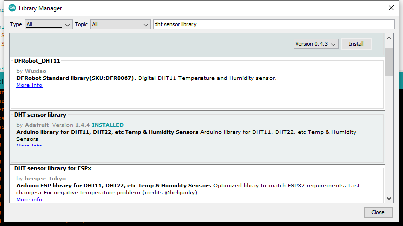

:::::::::::::::::::::::::::::::::::::: questions 

- Question

::::::::::::::::::::::::::::::::::::::::::::::::

::::::::::::::::::::::::::::::::::::: objectives

- Objective
::::::::::::::::::::::::::::::::::::::::::::::::

## Connecting the temperature sensor

### ToDo
Explain how to connect the DHT11/22 sensor according to image below


Before entering our code we need to install a special library that is required for the temperature sensor. Without the library the code that we will need to write to get the sensor to work will be much more complicated. Fortunately there are many people around the world the write the difficult code and make it available as libraries for us to make our lives easier.

To install the library click on the `Tools` menu item and then select `Manage libraries...`. The Library Manager window should pop up. In the text field type `dht sensor library` and press enter to search for the library. Look for the entry "**DHT sensor library** by **Adafruit**" and then click on the Install button.



Close the library manager by clicking on the `Close` button. Next we want to create a new sketch. Click on `File` and then `New`. A new instance of the Arduino IDE should open. You can now enter the code below in the editor


```c
#include <DHT.h>

#define DHT_SENSOR_TYPE DHT22
#define DHT_SENSOR_PIN 32 // ESP32 pin connected to DHT sensor

const int readingdelay = 3000;

DHT dht_sensor(DHT_SENSOR_PIN, DHT_SENSOR_TYPE);

void setup() {
  Serial.begin(9600); // initialize serial
  Serial.println(F("Starting ..."));
  dht_sensor.begin(); // initialize the DHT sensor
}

void loop() {

  float temperature = dht_sensor.readTemperature();   // read temperature in Celsius


  if (isnan(temperature)) {
    Serial.println("Failed to read from DHT sensor!");
  } else {
    char tempString[8];
    dtostrf(temperature, 1, 2, tempString);
    Serial.print("Temperature: ");
    Serial.println(temperature);
  }

  // wait a 3 seconds between readings
  delay(readingdelay);
}

```

Once you have entered the code you can press the `Upload` button again. The code should compile and then upload to the microcontroller board. Don't forget to press and hold down the `BOOT` button until the uploading starts.

:::: discussion

Explanation of the code

::::

::::::::::::::::::::::::::::::::::::: keypoints 

- Keypoint

::::::::::::::::::::::::::::::::::::::::::::::::

[r-markdown]: https://rmarkdown.rstudio.com/
