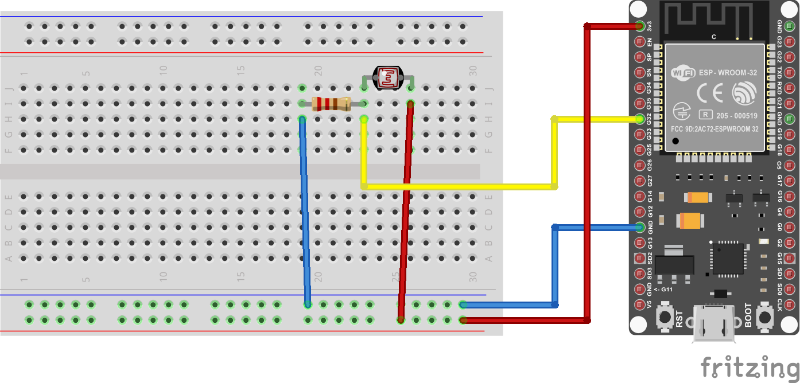

:::::::::::::::::::::::::::::::::::::: questions 

- Question

::::::::::::::::::::::::::::::::::::::::::::::::

::::::::::::::::::::::::::::::::::::: objectives

- Objective
::::::::::::::::::::::::::::::::::::::::::::::::

## Connecting a light level sensor

### ToDo

Explain how to connect the resistors according to image below



```c
#define LIGHT_SENSOR_PIN 32 // ESP32 pin GIOP36 (ADC0)

const int readingdelay = 3000;

void setup() {
  Serial.begin(9600); // initialize serial
  Serial.println(F("Starting ..."));
}

void loop() {

  int lightlevel = analogRead(LIGHT_SENSOR_PIN);     // read light level
  Serial.print("Light: ");
  Serial.println(lightlevel)};

  // wait a 3 seconds between readings
  delay(readingdelay);
}

```

:::: Discussion

Explanation of the code

:::


::::::::::::::::::::::::::::::::::::: keypoints 

- Keypoint

::::::::::::::::::::::::::::::::::::::::::::::::

[r-markdown]: https://rmarkdown.rstudio.com/
